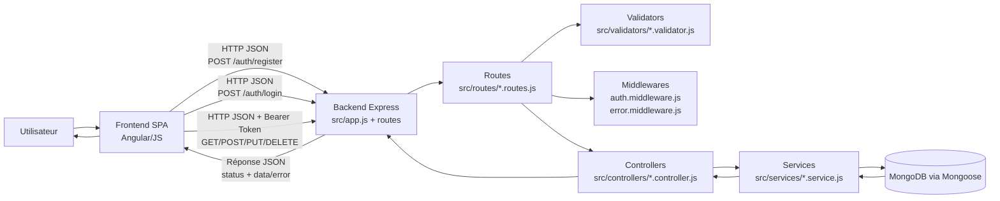
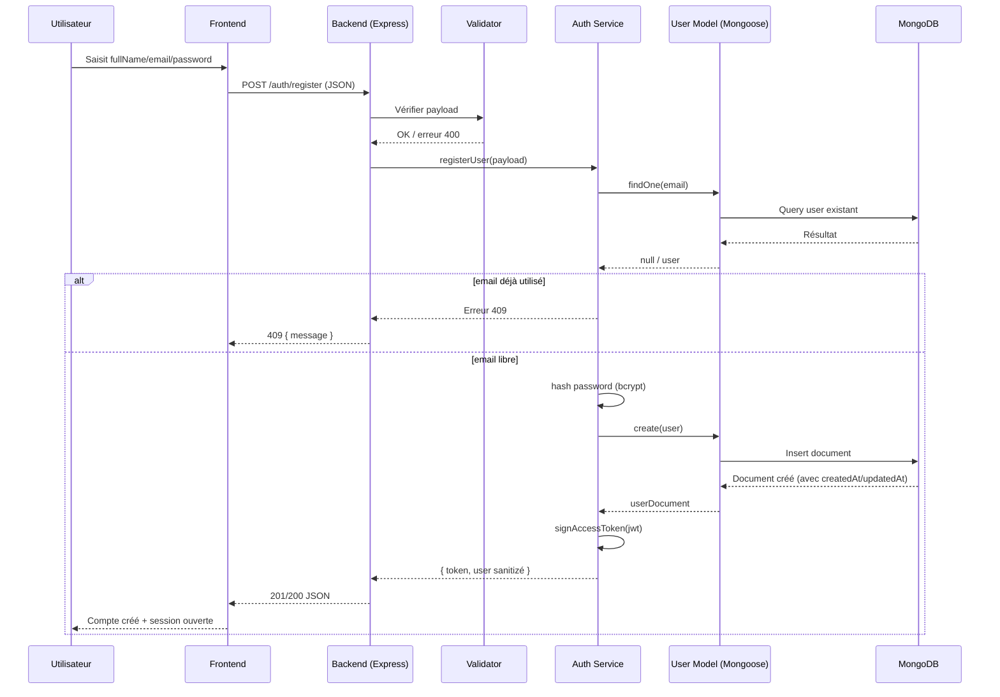

# Schéma de communication Frontend / Backend

Ce document décrit la communication entre la partie frontend (ex: Angular) et le backend Node.js/Express du projet.

## 1) Vue d'ensemble (architecture)

## 2) Pipeline d'une requête (détail)

1. Le frontend envoie une requête HTTP au backend.
2. La route cible est résolue (ex: auth, client, invoice, payment, stats).
3. Le validateur vérifie le format des données d'entrée.
4. Le middleware d'auth vérifie le token JWT si la route est protégée.
5. Le controller reçoit la requête validée et délègue la logique métier au service.
6. Le service interagit avec les modèles Mongoose et la base MongoDB.
7. Le service retourne un résultat métier au controller.
8. Le controller renvoie une réponse JSON.
9. En cas d'erreur, error middleware harmonise la réponse (code + message).

## 3) Séquence détaillée: inscription utilisateur

## 4) Authentification et routes protégées

- Login: le frontend envoie email/password vers POST /auth/login.
- Backend: compare le mot de passe via bcrypt.
- Si succès: renvoie un JWT.
- Frontend: stocke le JWT (de préférence en mémoire ou cookie sécurisé selon stratégie).
- Requêtes suivantes: envoie Authorization: Bearer <token>.
- auth.middleware.js: vérifie la signature JWT et injecte l'utilisateur dans req.user.

## 5) Format des échanges

- Requête frontend -> backend:
  - Méthode HTTP (GET/POST/PUT/DELETE)
  - Headers (Content-Type, Authorization)
  - Body JSON
- Réponse backend -> frontend:
  - Code HTTP (200, 201, 400, 401, 403, 404, 409, 500)
  - Body JSON avec data ou error/message

## 6) Points de synchronisation importants

- Validation côté frontend: UX rapide (optionnel mais recommandé).
- Validation côté backend: obligatoire (source de vérité).
- Gestion d'erreurs uniforme: simplifie l'affichage frontend.
- Contrat d'API stable: éviter de casser le frontend lors des évolutions backend.

## 7) Exemple de cycle complet (route protégée)

1. Frontend récupère le token après login.
2. Frontend appelle une route métier (ex: invoices) avec Bearer token.
3. Backend vérifie le token via middleware.
4. Controller appelle service.
5. Service lit/écrit MongoDB.
6. Backend renvoie JSON.
7. Frontend met à jour l'UI.
